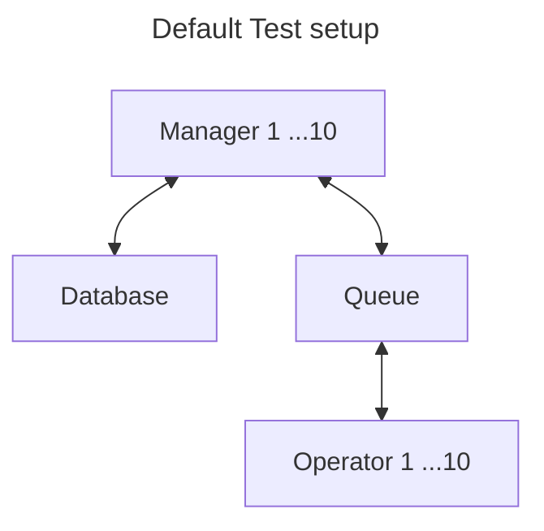

# Orbital Regression Testing

This directory contains regression tests for the Orbital library.

## Table of Contents

- [Test Setup](#test-setup)
- [Test Execution](#test-execution)

## Test Setup



The diagram above illustrates the basic setup, showing the number of managers
and operators and how they are connected to the database and queue.
To change the number of managers or operators, please refer to the test
execution command below.

## Test Execution

To run the regression test with default values, use the following make command:

```sh
make test-regression
```

To modify the parameters, run the following command:

```sh
REGRESSION_NO_JOBS=100 \
REGRESSION_NO_MANAGERS=10 \
REGRESSION_NO_OPERATORS=10 \
REGRESSION_TIMEOUT_MINUTES=3 \
REGRESSION_ACTIVE=true \
go test -race -count=1 ./regression/... -v
```

here:

| Parameter | Description |
| ------------- | -------------- |
| `REGRESSION_NO_JOBS`         | Sets the number of jobs to create.                |
| `REGRESSION_NO_MANAGERS`     | Sets the number of manager instances.             |
| `REGRESSION_NO_OPERATORS`    | Sets the number of operator instances.            |
| `REGRESSION_TIMEOUT_MINUTES` | Sets the test timeout duration in minutes.        |
| `REGRESSION_ACTIVE`          | Must be set to `true` to enable the regression test. |
